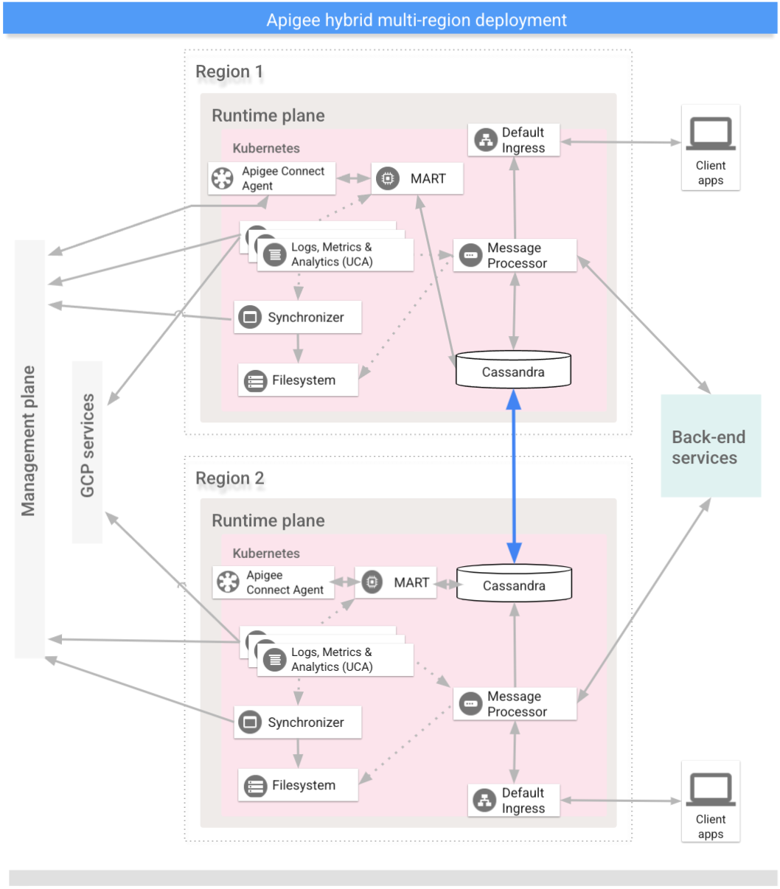

# Multi-region deployment of Apigee hybrid on GKE

Documentation: 
- https://docs.cloud.google.com/apigee/docs/hybrid/v1.16/multi-region
- https://docs.cloud.google.com/apigee/docs/hybrid/v1.16/big-picture
- https://partner.skills.google/focuses/44876?parent=catalog

- https://docs.cloud.google.com/apigee/docs/hybrid/v1.16/ports
- https://docs.cloud.google.com/apigee/docs/api-platform/troubleshoot/playbooks/cassandra/cassandra-data-replication-failure
- https://docs.cloud.google.com/apigee/docs/hybrid/preview/helm-install

In this project, we will create a hybrid Apigee installation on Google Kubernetes Engine (GKE). We will use the Apigee Hybrid 

